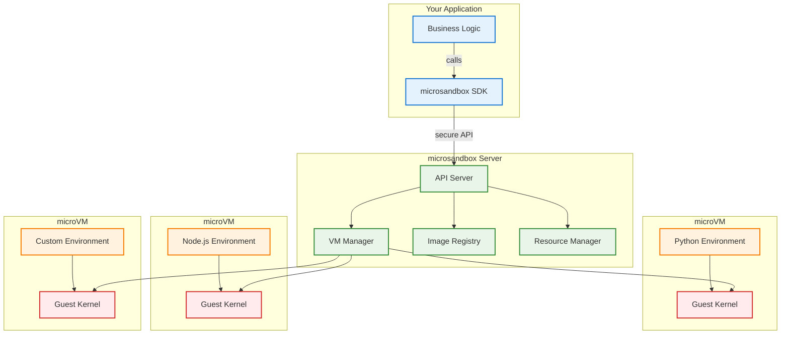
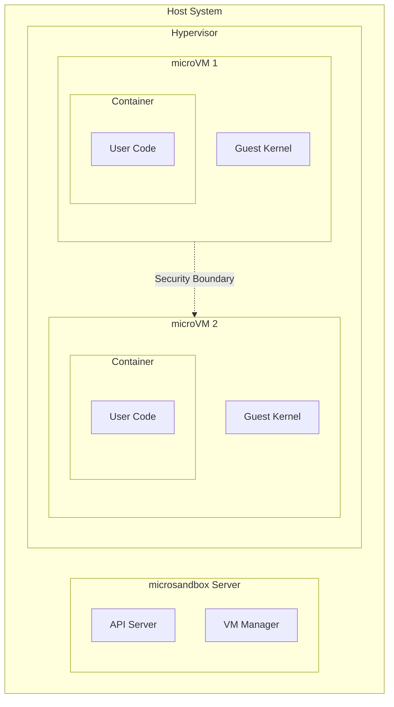
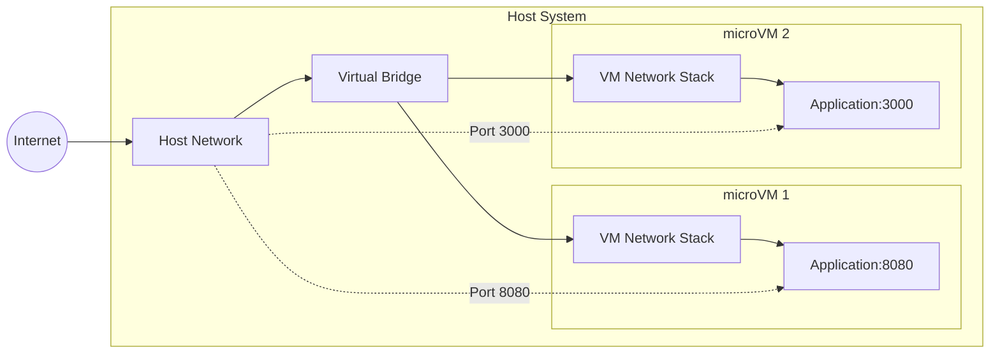
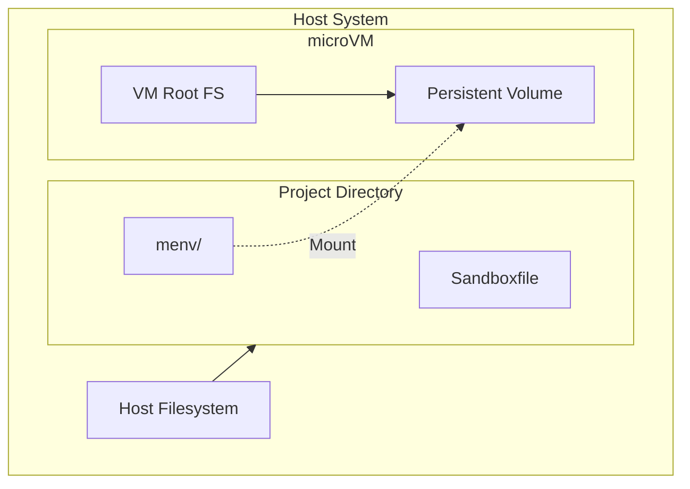

# Architecture

Understand how microsandbox works under the hood, its security model, and the technology that makes fast, secure code execution possible.

!!!info What You'll Learn

- How microsandbox achieves VM-level security with fast startup
- The difference between microVMs and containers
- System architecture and component interaction
- Security isolation mechanisms
  !!!

### Overview

microsandbox is built on **microVMs** - lightweight virtual machines that provide true kernel-level isolation while maintaining the fast startup times typically associated with containers. This unique approach solves the fundamental trade-off between security and performance.

### System Architecture



### Core Components

#### microsandbox SDK

The SDK provides language-specific interfaces for interacting with sandboxes:

- **High-level APIs** for common operations
- **Async/await support** for non-blocking execution
- **Type safety** with proper error handling
- **Resource management** with automatic cleanup

#### microsandbox Server

The server manages the lifecycle of microVMs and provides:

- **API Server** - RESTful API for sandbox operations
- **VM Manager** - Creates, manages, and destroys microVMs
- **Image Registry** - Caches and manages container images
- **Resource Manager** - Enforces CPU, memory, and disk limits

#### MicroVMs

Each sandbox runs in its own microVM with:

- **Dedicated kernel** - Complete OS isolation
- **Isolated memory space** - No shared memory with host
- **Virtual networking** - Controlled network access
- **Ephemeral storage** - Clean state for each execution

### Security Model

#### True VM-Level Isolation

Unlike containers that share the host kernel, microsandbox provides complete isolation:

##### microVMs vs Containers

**microVMs (microsandbox)**

- Separate guest kernel per sandbox
- Hardware-level isolation
- Cannot escape to host system
- True multi-tenancy safe

**Containers (Docker, etc.)**

- Shared host kernel
- Process-level isolation only
- Potential for kernel exploits
- Limited security for untrusted code

##### Isolation Layers

**Hardware Level**

- CPU virtualization extensions (Intel VT-x, AMD-V)
- Memory management unit isolation
- I/O device virtualization

**Kernel Level**

- Separate guest kernel per microVM
- No shared kernel data structures
- Independent system call handling

**Process Level**

- Standard Unix process isolation within guest
- Container-like namespacing inside microVM
- Resource limits enforced by guest kernel

#### Security Boundaries



Each microVM provides multiple layers of protection:

1. **Hardware isolation** via hypervisor
2. **Kernel isolation** via separate guest OS
3. **Process isolation** via container runtime
4. **Resource isolation** via cgroups and limits

### Performance Characteristics

#### Fast Startup Times

microsandbox achieves fast startup through several optimizations:

- **Pre-warmed VMs** - Keep a pool of ready microVMs
- **Optimized images** - Minimal base images with fast boot
- **Snapshot restoration** - Resume from saved VM states
- **Lazy loading** - Load resources on-demand

#### Resource Efficiency

Despite using VMs, microsandbox is resource-efficient:

- **Minimal overhead** - ~10-50MB RAM per microVM
- **Shared base images** - Deduplication across VMs
- **Dynamic scaling** - VMs created/destroyed on demand
- **Resource limits** - Prevent resource exhaustion

#### Startup Time Comparison

| Technology       | Cold Start | Warm Start | Security Level  |
| ---------------- | ---------- | ---------- | --------------- |
| **microsandbox** | ~100-500ms | ~10-50ms   | VM-level        |
| Docker           | ~50-200ms  | ~10-30ms   | Process-level   |
| Traditional VM   | 10-60s     | 5-30s      | VM-level        |
| Cloud Functions  | 100ms-10s  | ~10ms      | Container-level |

### Networking

#### Network Isolation

Each microVM has its own network stack:

- **Virtual network interfaces** - Isolated from host networking
- **Controlled internet access** - Configurable outbound rules
- **Port mapping** - Selective exposure of services
- **DNS resolution** - Sandboxed DNS queries

#### Network Architecture



### Storage

#### Ephemeral Storage

By default, microVMs use ephemeral storage:

- **Clean state** - Each execution starts fresh
- **No persistence** - Changes discarded on shutdown
- **Security benefit** - No data leakage between executions

#### Persistent Storage

For development workflows, microsandbox supports persistence:

- **Volume mounts** - Host directories mounted into microVM
- **Project persistence** - Automatic persistence for project sandboxes
- **Snapshot storage** - Save/restore VM states

#### Storage Architecture



### Image Management

#### Container Image Compatibility

microsandbox uses standard container images:

- **Docker Hub** - Pull from public registries
- **Private registries** - Support for authenticated registries
- **Local images** - Use locally built images
- **Multi-architecture** - Support for different CPU architectures

#### Image Optimization

Images are optimized for microVM execution:

- **Minimal base images** - Reduced attack surface and faster boot
- **Layer caching** - Efficient storage and transfer
- **Compression** - Reduced network and storage overhead

### Resource Management

#### CPU and Memory Limits

Each microVM can have enforced limits:

```yaml
sandboxes:
  resource-limited:
    image: python
    cpus: 2 # Maximum 2 CPU cores
    memory: 1024 # Maximum 1GB RAM
```

#### Resource Enforcement

Limits are enforced at multiple levels:

1. **Hypervisor level** - Hard limits on VM resources
2. **Guest kernel level** - cgroups within the VM
3. **Application level** - Runtime-specific limits

### Monitoring and Observability

#### Metrics Collection

microsandbox provides visibility into:

- **Resource usage** - CPU, memory, disk, network
- **Execution metrics** - Runtime, success/failure rates
- **System health** - VM pool status, server performance

#### Logging

Comprehensive logging at all levels:

- **Application logs** - stdout/stderr from user code
- **System logs** - VM lifecycle and system events
- **Audit logs** - Security and access events

### Scalability

#### Horizontal Scaling

microsandbox can scale across multiple machines:

- **Distributed VM management** - VMs across multiple hosts
- **Load balancing** - Distribute workload efficiently
- **Auto-scaling** - Dynamic capacity management

#### Vertical Scaling

Optimize resource usage per machine:

- **VM density** - More VMs per host with efficient packing
- **Resource sharing** - Intelligent resource allocation
- **Performance tuning** - Optimize for specific workloads

### Next Steps

Now that you understand the architecture, explore:

- [!ref Security Best Practices](/guides/security.md) - Security considerations and best practices
- [!ref Configuration Guide](configuration.md) - Detailed configuration options
- [!ref Performance Tuning](/guides/performance.md) - Optimize for your use case
- [!ref Deployment Guide](/guides/deployment.md) - Production deployment strategies
