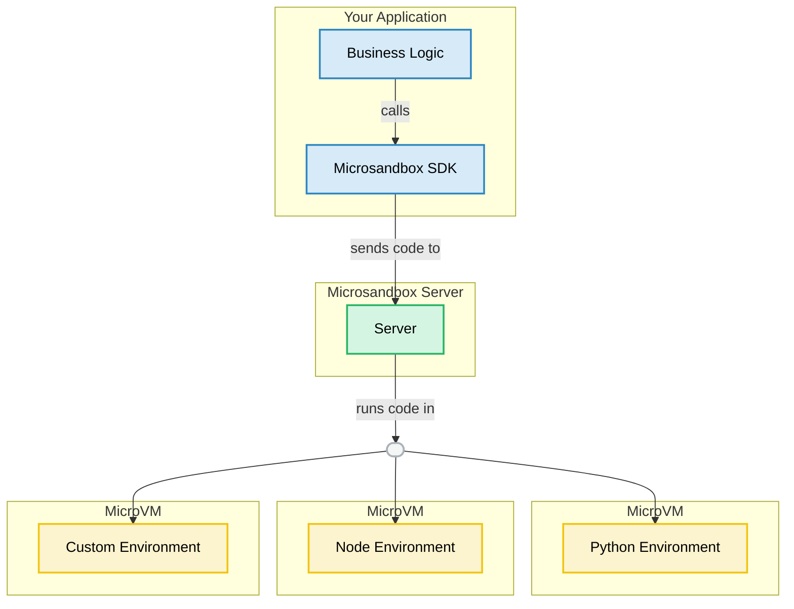

# Welcome to Microsandbox

<div align="center">
  
</div>

<div align="center"><b>———&nbsp;&nbsp;&nbsp;easy secure execution of untrusted user/ai code&nbsp;&nbsp;&nbsp;———</b></div>

<br />

**Microsandbox** provides secure, self-hosted sandboxes for your AI agents with true VM-level security isolation and fast startup times.

## Why Microsandbox?

Building AI agents that generate and execute code? Need to run untrusted user code?

Maybe you've tried running the code:

- **Directly on your machine** — Security risk for your machine [→](https://horizon3.ai/attack-research/disclosures/unsafe-at-any-speed-abusing-python-exec-for-unauth-rce-in-langflow-ai/)
- **In docker containers** — Limited isolation for untrusted code
- **In traditional VMs** — Minutes to start up, heavy resource usage
- **In cloud sandboxes** — Less control over your infra and lose rapid dev cycles

**microsandbox** solves all these issues for you with:

- True VM-Level Security Isolation with Fast Startup Times
- Self-Hosted with Full Control and Local Setup
- Seamless Transition from Local to Production
- Compatibility with Standard Container Images
- Integration with Any MCP Enabled AI

<div align='center'>• • •</div>

## Quick Start

Get started in easy steps:

### 1. Start the Server

Install microsandbox and start the server:

```bash
curl -sSL https://get.microsandbox.dev | sh
msb server start --dev
```

!!!tip
microsandbox server is also an [MCP server](https://modelcontextprotocol.io), so it works directly with Cursor, Agno, and other MCP-enabled AI tools and agents.
!!!

### 2. Install the SDK

Choose your preferred programming language:

+++ Python

```bash
pip install microsandbox
```

+++ JavaScript

```bash
npm install microsandbox
```

+++ Rust

```bash
cargo add microsandbox
```

+++

### 3. Execute Code

Choose the appropriate sandbox environment for your needs:

+++ Python

```python
import asyncio
from microsandbox import PythonSandbox

async def main():
    async with PythonSandbox.create(name="test") as sb:
        exec = await sb.run("name = 'Python'")
        exec = await sb.run("print(f'Hello {name}!')")
        print(await exec.output())  # prints Hello Python!

asyncio.run(main())
```

+++ JavaScript

```javascript
import { NodeSandbox } from "microsandbox";

async function main() {
  const sb = await NodeSandbox.create({ name: "test" });
  try {
    let exec = await sb.run("var name = 'JavaScript'");
    exec = await sb.run("console.log(`Hello ${name}!`)");
    console.log(await exec.output()); // prints Hello JavaScript!
  } finally {
    await sb.stop();
  }
}

main().catch(console.error);
```

+++ Rust

```rust
use microsandbox::{SandboxOptions, PythonSandbox};

#[tokio::main]
async fn main() -> Result<(), Box<dyn std::error::Error>> {
    let mut sb = PythonSandbox::create(
        SandboxOptions::builder().name("test").build()
    ).await?;

    let exec = sb.run(r#"name = "Python""#).await?;
    let exec = sb.run(r#"print(f"Hello {name}!")"#).await?;
    println!("{}", exec.output().await?); // prints Hello Python!

    sb.stop().await?;
    Ok(())
}
```

+++

<div align='center'>• • •</div>

## Use Cases

### :computer: Coding & Dev Environments

Let your AI agents build real apps with professional dev tools. Perfect for AI pair programming, coding education platforms, and automated code generation where quick results matter.

### :chart_with_upwards_trend: Data Analysis

Transform raw numbers into meaningful insights with AI that works safely with powerful libraries like NumPy, Pandas, and TensorFlow while respecting data privacy.

### :globe_with_meridians: Web Browsing Agents

Build AI assistants that can browse the web, extract data, fill out forms, and handle logins in a contained environment.

### :rocket: Instant App Hosting

Share working apps and demos in seconds without deployment headaches. Zero-setup deployment means immediate value.

<div align='center'>• • •</div>

## Architecture



## What's Next?

- **New to Microsandbox?** Start with our [Installation Guide](getting-started/installation.md)
- **Want to self-host?** Check out [Self-Hosting](getting-started/self-hosting.md)
- **Ready to code?** Explore our [SDKs](sdks/index.md)
- **Need examples?** Browse our [Examples](examples/index.md)
- **Using the CLI?** See the [CLI Reference](cli/index.md)
- **Working with projects?** Learn about [Projects](projects/index.md)

---

!!!info "Need help?"
Join our [Discord community](https://discord.gg/T95Y3XnEAK) or check out the [GitHub repository](https://github.com/microsandbox/microsandbox).
!!!
